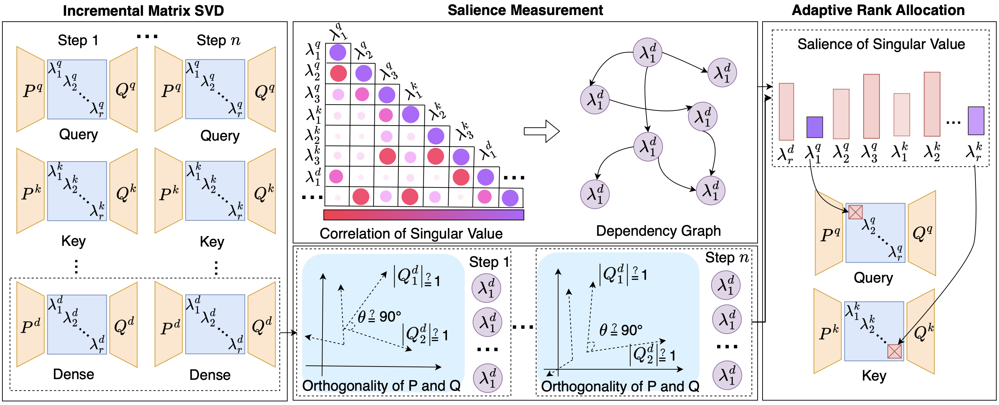

# SalientLoRA: Unveiling LoRA Intrinsic Ranks via Salience Analysis

This is the implementation of paper: Unveiling LoRA Intrinsic Ranks via Salience Analysis.



SalientLoRA adaptively optimizes intrinsic ranks of LoRA via salience measurement. Firstly, during rank allocation, the salience measurement analyses the variation of singular value magnitudes across multiple time steps and establishes their inter-dependency relationships to assess the matrix importance. This measurement mitigates instability and randomness that may arise during importance assessment. Secondly, to achieve a balance between fine-tuning performance and efficiency, we propose an adaptive adjustment of time-series window, which adaptively controls the size of time-series for significance measurement and rank reduction during training, allowing for rapid rank allocation while maintaining training stability. This mechanism enables matrics to set a higher initial rank, thus expanding the allocation space for ranks.

---


## Quick Start

1. Install the `loralib`, which is the updated version from the original source code. The update adds a new executable file [loralib/salientlora.py](loralib/loralib/salientlora.py), which includes functions for SVD-based decomposition of model parameter weights, and rank adaptive allocation during fine-tuning. 

  ```bash 
  pip install -e loralib/ 
  ```


2. Apply SVD-based decomposition to the model designated for fine-tuning. Subsequently, load the raw language model and set only the LoRA parameters as trainable.

  ```python
  # Apply SVD-based decomposition to the model for fine-tuning
  # Replace the initial linear layers in the model with SVD layers.
  # The initial linear layers: layer = nn.Linear(in_features, out_features)
  
  # Add a SVD-based adaptation matrices with rank r=12
  import loralib 
  layer = loralib.SVDLinear(in_features, out_features, r=12)
  
  # load the raw LM
  model = AutoModelForSequenceClassification.from_pretrained(
          model_args.model_name_or_path,
          from_tf=bool(".ckpt" in model_args.model_name_or_path),
          config=config
      )
  
  # Mark only LoRA parameters as trainable by setting requires_grad to False for all other parameters 
  loralib.mark_only_lora_as_trainable(model)
  ```


3. Apply `RankAllocator` to  adaptively allocate ranks during training.

  ```python
  from loralib import RankAllocator
  from loralib import compute_orth_regu 
  # Initialize the RankAllocator 
  rankallocator = RankAllocator(
      model, target_average_rank=2, initial_average_rank=15,
      init_warmup=500, rank_allocaiton_steps=3500, initial_window = 10, final_window = 200, total_step=3000, beta=0.9, gamma=2, lammbda=0.7, beta 0.9)
  ```
The RankAllocator primarily comprises two parts.

+ At each step of the training,  `adaptive_time_windows` determines the end of the current time series, updating the size of the time-series window and the current size of the retained ranks.

```python
curr_rank, mask_ind = self.adaptive_time_window(global_step) 
# curr_rank: the size of the ranks currently retained
# mask_ind：whether it is the final step in the current time-series
```

+ If it is the final step in the time-series, the salience scores of the singular values are calculated, and the unimportant ranks are pruned.

```python
# Mask to target budget 
mask_threshold = self.mask_to_target_rank(model, curr_rank)
```


## Paper results replication

We conduct experiments on the GLUE benchmark for NLU tasks, the XSum and CNN datasets for NLG tasks, and the MT dataset for instruction tuning, separately fine-tuning encoder-only (DeBERTaV3-base), encoder-decoder (BART-large and T5-base), and decoder-only (LLaMA) models.

For details on replicating the results, please refer to the following directories: 

[./NLU](./NLU) contains the code to finetune DeBERTaV3-base with the GLUE benchmark, which including eight dataset: CoLA, SST-2, MRPC, QQP, STS-B, MNLI, QNLI, and RTE. 

[./NLG](./NLG) contains the code to finetune BART-large and T5-base with the XSum and CNN datasets. 

[./Instruction_Tuning](./Instruction_Tuning) contains the code to finetune LLaMA-7B and LLaMA2-7B with the Alpaca instruction tuning dataset. 


